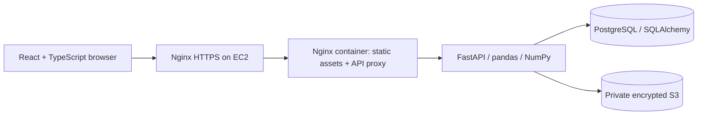

# Architecture

Local development replaces the edge Nginx with Vite's proxy, PostgreSQL with SQLite, and S3 with a filesystem storage adapter. The API and analysis code remain the same. Docker Compose exercises PostgreSQL with local file storage.

## Upload lifecycle

1. `/api/session` establishes a random HttpOnly, SameSite=Strict cookie. The API returns a derived CSRF token for subsequent writes.
2. `/api/reports` validates format, size, dimensions, and headers. CPU work executes in the thread pool, outside the async event loop.
3. pandas/NumPy calculate quality metrics, frequency distributions, and row-level flags once at ingest.
4. The original bytes are stored locally or in S3 under generated owner/report keys. Client filenames never become filesystem paths.
5. SQLAlchemy persists a report profile and batches row inserts. If database persistence fails, the uploaded object is removed.
6. Table reads page through `(report_id, row_number)` indexes; issue filtering uses `(report_id, has_issues)`. Text search uses an escaped substring query and is intentionally not described as full-text indexing.
7. A cleaning request stores options and a summary. Export regenerates a cleaned copy from the preserved original. Dashboard metrics are clearly labeled as original-data metrics.

## Decisions worth discussing

- **Automatic inference vs explicit schemas:** flexible CSV support with visible heuristics. Numeric columns with fewer than 80% valid values stay text. There is no claim of general semantic data validation.
- **Precomputed profile vs repeated analysis:** ingest costs more, but navigation does not rerun all checks. User-chosen chart aggregations parse the bounded original file on demand and are cached briefly in the browser.
- **Session workspace vs accounts:** reduces demo friction while protecting separate visitors' reports. It does not offer identity recovery, cross-device access, or team roles.
- **Single EC2 host:** understandable deployment and low operational complexity. PostgreSQL and API share a host; there is no high-availability or automatic failover claim. Backups are an operator responsibility.
- **Cleaning rules:** trim selected spaces and remove exact duplicates or empty rows. No silent imputation or outlier deletion.
- **Schema changes:** version 1 uses SQLAlchemy `create_all` for first initialization. This is not a migration system. Add explicit, tested migrations before changing an existing deployment's schema.

## Operational surfaces

- `/api/health` verifies database connectivity; Compose waits for health before considering the service ready.
- Responses include `X-Request-ID` and `Server-Timing`. Structured access metadata excludes file contents and cookies.
- API concurrency and request sizes are bounded. Nginx limits upload frequency and other API request rates. These are basic safeguards, not a comprehensive abuse prevention system.
- Production cookies require HTTPS. The AWS stack leaves host Nginx stopped until the operator configures DNS and TLS.
- The EC2 instance role permits only object operations against its own S3 bucket. SSM provides administration without port 22. GitLab can assume a role scoped to a single project main branch and instance.
