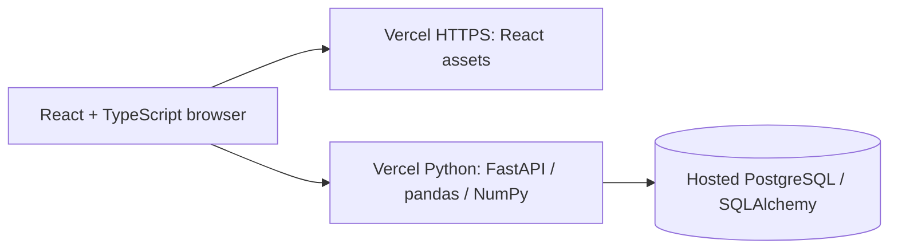

# Architecture

The hosted configuration stores accounts, sessions, reports, rows, and original CSV bytes in a dedicated PostgreSQL database. Local development uses Vite's proxy with SQLite and a filesystem adapter. The alternative Docker/AWS path uses Nginx, PostgreSQL, and optional private S3 storage. The application and analysis code are shared.

## Upload lifecycle

1. `/api/session` establishes a random HttpOnly, SameSite=Strict cookie. The API returns a derived CSRF token for subsequent writes.
2. `/api/reports` validates format, size, dimensions, and headers. CPU work executes in the thread pool, outside the async event loop.
3. pandas/NumPy calculate quality metrics, frequency distributions, and row-level flags once at ingest.
4. Original bytes are stored in PostgreSQL, or through the filesystem/S3 adapter in the alternative deployment. Generated owner/report keys prevent client filenames from becoming filesystem paths.
5. SQLAlchemy persists a report profile and batches row inserts. If database persistence fails, the uploaded object is removed.
6. Table reads page through `(report_id, row_number)` indexes; issue filtering uses `(report_id, has_issues)`. Text search uses an escaped substring query and is intentionally not described as full-text indexing.
7. A cleaning request stores options and a summary. Export regenerates a cleaned copy from the preserved original. Dashboard metrics are clearly labeled as original-data metrics.

## Decisions worth discussing

- **Automatic inference vs explicit schemas:** flexible CSV support with visible heuristics. Numeric columns with fewer than 80% valid values stay text. There is no claim of general semantic data validation.
- **Precomputed profile vs repeated analysis:** ingest costs more, but navigation does not rerun all checks. User-chosen chart aggregations parse the bounded original file on demand and are cached briefly in the browser.
- **Guests and accounts:** guest visitors can begin immediately. Named accounts retain access across devices and may import guest reports. Database sessions are revocable; password recovery rotates a one-time recovery code and invalidates other sessions. Account row locks serialize password reset and login. Team roles are not implemented.
- **Bounded database uploads:** retaining small original files in PostgreSQL avoids an additional object service for the Vercel deployment. Larger-file workflows should move originals to private object storage and use asynchronous jobs.
- **Cleaning rules:** trim selected spaces and remove exact duplicates or empty rows. No silent imputation or outlier deletion.
- **Schema changes:** SQLAlchemy `create_all` initializes missing tables. It does not change existing columns. Add explicit, tested migrations before altering existing schema.

## Operational surfaces

- `/api/health` verifies database connectivity; Compose waits for health before considering the service ready.
- Responses include `X-Request-ID` and `Server-Timing`. Structured access metadata excludes file contents and cookies.
- API work per process and request sizes are bounded. Authentication rate limits persist in the database. The alternative Nginx configuration additionally rate-limits requests. Global distributed upload concurrency is not implemented.
- Production cookies require HTTPS. The AWS stack leaves host Nginx stopped until the operator configures DNS and TLS.
- The EC2 instance role permits only object operations against its own S3 bucket. SSM provides administration without port 22. GitLab can assume a role scoped to a single project main branch and instance.
